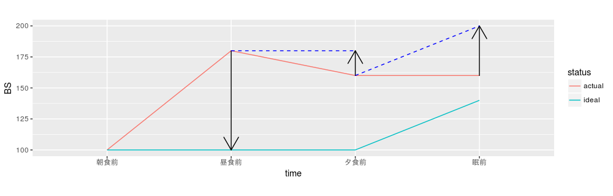

```{r setup, include = FALSE}
knitr::opts_chunk$set(echo = FALSE, message = FALSE, warning = FALSE)
library(tidyverse)
library(pipeR)
library(DT)
library(data.table)
library(DiagrammeR)
library(knitr)
library(rmarkdown)
library(blogdown)
library(formattable)
indentS <- function(indent = 1){str_c("<ul>\n",rep("<li>",indent))}
indentE <- function(indent = 1){str_c(rep("</li>",indent),"\n</ul>")}
```

# インスリン治療法の分類

* BBT: basal-bolus treatment
    - 基礎インスリン(basal) 1~2回/日 + 追加インスリン(bolus) 3回/日
* B2B: basal 2 bolus (basal 2 plusとも)
    - basal 1(~2)回/日 + bolus 2回/日
* BOT: basal supported oral therapy
    - インスリンはbasalのみ
* 速効型or超速効型食前頻回投与
    - bolusのみという理解でOK
* 混合型インスリン
    - 混合型インスリン2~3回/日

basalは持効型溶解インスリン、bolusは速効型or超速効型を用いる。

## 使い分け

```{r}
tibble(
  ` `=c("BBT", "B2B", "BOT", "食前頻回","混合型"),
  merit = c("最も生理的分泌を模す", "昼は仕事で注射不可な人にも","bolusが減ったver.", "食後血糖のみ高い人に", "投与がわかりやすい")
) %>% kable()
```

ただし混合型は

メリット：

* 注射回数↓
* 1種類のみでコントロール可

デメリット：

* どうしても血糖変動**大**
* 混合比率の調整不能
* 投与間隔に生活リズムの方を合わせないといけない。

より、あくまで低血糖を避けられる場合のみ検討。生活スタイルや食事摂取量が不規則なら不向き。

## 何を導入するか？

* 入院の大部分：BBTor超速効型3回/日
* 外来で多用　：Mid-Mix混合型3回/日

入院でやるなら、まずBBTで糖毒性を解除してから他の方法に切り替えるのがおすすめ。


## 速効型と超速効型の違い

```{r}
tibble(
  ` ` = c("速効型", "超速効型"),
  投与timing = c("食事30分前", "食直前"),
  持続時間=c("用量依存的にtail延長", "効果は↑だが時間は一定(5h)")
) %>% kable()
```

超速効型の食直前とは、食事が目の前に用意されてから。無理に食前にせずとも、食事中、食後すぐでもOK。

## 混合型インスリンの分類

* Low-Mix(超速効型3:中間型7)製剤2回/日投与
    - 旧来の主流。混合比率の調整不能。また、投与間隔に生活リズムの方を合わせないといけない。
* Mid-Mix(超速効型5:中間型5)製剤3回/日投与
    - 外来で多用。低血糖が比較的少ない。リスプロ(ヒューマログ）ミックス50など。
* High-Mix(超速効型7:中間型3)製剤
    - ビミョーって本に書いてあった。
* ライゾデグ
    - デグルデグ（トレシーバ、持効型溶解） + ノボラピッド（超速効型）の混合（モル比7:3）。これから増えていきそう。

## インスリンスライディングスケール

* 本来インスリンは高血糖になる**前**に打つもの。高血糖時に打つのでは後手に回ってしまう。
* あくまでい一時しのぎ。なるべく早く（1〜2日で）固定打ちに切り替える。
* 使うときは、食事量不安定時、インスリン導入時の必要量予測困難例など

`e.g.` 毎食直前（食直後投与）

```{r}
tibble(
  BS=c("150-", "200-", "250-", "300-", "350-"),
  超速効型=c(2,4,6,8,10)
) %>% kable()
```

ただし食事摂取量に応じて減量。

```{r}
tibble(
  ` `=c("3〜7割", "〜2割"),
  超速効型=c("半量", "投与中止")
) %>% kable()
```

`e.g.` 眠前

```{r}
tibble(
  BS=c("200-", "250-", "300-"),
  超速効型=c(2,4,6)
) %>% kable()
```

## インスリン静脈内投与

```{r}
tibble(
  ` `=c("点内注", "CVII"),
  正式名称=c("点滴内注射", "continuous intravenous insulin"),
  詳細=c("点滴ボトル内に混注", "シリンジポンプを用いて一定速度でインスリン注入"),
  merit =c("原理上Gluとの流入比率一定・管理が楽", "血中半減期6minなので迅速対応可"),
  demerit=c("調節間隔が長い患者限定", "面倒"),
  よい適応=c("一般病棟", "ICU（術後12-24h・DM緊急症後12-24h）")
) %>% kable()
```

* 点内注では、速効型を1単位/Glu6.25gを基準に、インスリン感受性に応じて増減。1単位/Glu5-10g程度の範囲で。過量回避したいなら1単位/Glu10gから開始。

* **これまで静脈内投与してきたインスリン量の結果が現在の血糖に反映されている**。
    - 無用なスライディングスケールはむしろ危険。
    - 責任インスリンの把握のため、点内注での血糖測定は輸液ボトル交換時。

# BBTの導入

## 考え方のポイント

### 責任インスリン

インスリンは**これから上昇する血糖を抑えるため**に使う。すでに高い血糖を下げるためではない！

→スライディングスケールは食事を普通に取れる人には不適当。

- bolusは対応する食直前に注射する。血糖1日4検なら対応する血糖値は次の食前血糖値。
- 早朝空腹時血糖の責任インスリンは基本的にbasal。

`e.g.` 早朝空腹時血糖↑の原因は？……basalの量不足？作用切れ？逆に多すぎる？と考えていく。

`tips` α-GI服用者、DM胃不全麻痺では血糖上昇が次の食前に遅れる。


### basal, bolusの協働

* basalで空腹時血糖を下げられているかどうかで、bolusの効果が変わる。
* basalをしっかり用いることが血糖controlだけでなく血糖安定、体重↑抑制にも寄与(4-Tstudy)
* **最優先は空腹時血糖の正常化($<110$mg/dL)**。

## 基本手順

1. 入院中の血糖測定は1日4検だけでなく6検も時々取り入れて食後血糖を把握→**インスリン分泌の動態を推定**

2. **Fix fasting first**.まずは持効型溶解インスリンで空腹時血糖を改善。
    - `e.g.`
```{r}
tibble(
  朝食前血糖=c("-80", "80-110", "110-140", "140-180", "180-"),
  インスリン単位=c("-2", "0", "+1~2", "+2~4", "+4~6")
) %>% kable()
```
    
※朝食前血糖は投与変更後2日間の平均で評価。

※CKDではインスリン代謝↓。増量は少量（2-4単位）ずつ。
    
3. **血糖の変動が平坦化**(理想：100-100-100-140)するようにbasal, bolusを調節。
    - basalをできる限り増やしておけばbolusは最低量で済む。
    - **血糖は以前の血糖の影響が累積して決まる**ことに注意。朝の血糖を下げると、つられて昼以降の血糖ベースラインが下がることを考慮して昼、夕も調節する。
    


4. 糖毒性解除
    - 入院10日あたりに多い。
    - 必要インスリン↓。低血糖に注意。ステップダウン（後述）により、インスリンごく少量まで減らせる………かも！

## コントロール目標

去年老年病・DM学会が共同でガイドラインを改定した。

## 状況別導入法

### 未治療DM患者

#### 適応

* 空腹時血糖$\ge200$
* 随時血糖$\ge300$
* HbA1c$\ge10%$

等は良い適応。

#### 手順

基本手順に準じる。

### インスリン以外のDM薬使用者

#### 適応

多岐にわたる。例は以下。

* 傾向血糖降下薬の長期使用によるインスリン分泌能↓（とくにHbA1c$\ge8%$）
* 周術期血糖コントロール
* 感染症併発予防
* ステロイド等による薬剤性高血糖の是正。

#### 手順

1. DM薬をすべて休薬。BBT導入しまずは糖毒性解除。漫然とした高血糖の悪循環を断ち切る。
    - SU薬、チアゾリジン薬は中止時に注意点あり。
2. １剤ずつ薬効を確かめながら調整。
    - 薬剤整理、ベストな血糖コントロールへ
    
### 混合型インスリン使用者

#### 適応

血糖コントロール不良、低血糖頻発患者等

#### 手順

1. 混合型の単位数をbasal/bolusに分解。
    - basal: $\times0.8$量からBBT開始
    - bolus: $\times1$量からBBT開始
2. BBT調整

## 糖毒性解除後

糖毒性解除によりインスリン必要量↓の可能性大。

患者にあわせてステップダウンなど検討していく。インスリン離脱できることも。

選択肢としては以下：

* BBT継続
* BBT + 経口DM治療薬
* B2B $\pm$ 昼グリニド
* BOT
* インスリン離脱
* 混合型インスリン
* ライゾデグ
* GLP-1受容体作動薬

### BBT継続

適応は、

* インスリン依存状態
    - 膵全摘後
    - T1DM
    - T2DM長期罹患
* 1日のインスリン量**多**

など

### BBT + 経口DM治療薬

1剤ずつ薬効を確かめながら調整する。グリニド薬以外は原則数日は効果判定に日程を割くこと。

### B2B $\pm$ 昼グリニド

昼はインスリン必要量**少**傾向。

理由：

* 活動性**高**
* インスリン拮抗ホルモン（コルチゾール・GH等）が朝より**低**

昼は仕事等で注射不能な患者もいるので、昼bolusをグリニドに置き換えるだけでも喜ばれることも。

### BOT

手順は以下：

1. 必ず、空腹時血糖を改善させておく
2. インスリン抵抗性改善薬（特にメトホルミン）併用でインスリン必要量↓
3. bolusを1日だけグリニド薬に置換
4. 食後血糖goodなら継続。**血糖悪化ならすぐあきらめる**。すぐ諦められるのは良いこと！

### インスリン離脱

離脱可能かの明確な指標は存在しないが、内因性インスリン分泌能を評価（後述）して推測する。

* 内因性分泌保持
* インスリン必要量**少**
* 血糖コントロール良好
* もと肥満だがBBTで体重↓果たした人

なら成功しやすい。

手順は以下：

1. BOTへ
2. DPP-4阻害薬をbasalに上乗せ
3. basal不要になったら離脱成功

※退院したらコントロール悪化する例も多いので、いつでもインスリンに戻れるよう患者を指導する。

### 混合型インスリン

特徴は(使い分けの項)参照。

切り替えてみてうまく行かないなら迷わずBBTに戻るorライゾデグへ移行。

### ライゾデグ

海外では2回/日の試験もあるが、現時点では1回/日が推奨される。

basal + 朝昼夕のbolusのいずれかを置き換える。残り2食分のbolusはそのまま。

※ライゾデグは投与開始後3日かけて定常状態に達するので、調整は3-4日ごと。

### GLP-1受容体作動薬

GLP-1作動薬への全切り替えが一時期流行ったが、タキフィラキシー（GLP-1の項参照）が生じるとうまくいかなくなる。治療法の保険適応が拡がってきており、インスリンとの併用可能な薬剤も。basal + GLP-1作動薬などの組み合わせが試されていて、悪くないらしい。

## 退院前にやっておくべきこと

* 退院後の生活変化は血糖↑**↓**ともにありうる！見越して十分聞き取り。
* 低血糖時の対応（後述）を指導
* 注射法、SMBG(血糖自己測定)法を学んでもらう
* 退院時指導。入院後経過・現在の状態・今後の治療を説明。
* 生活の中で食事・運動療法ができるよう、家族等も巻き込んで工夫を話し合う（コメディカルの本領）

※退院後の外来受診は2wk後目安。

## 特殊な状態への対応

### 低血糖

血糖$\le65〜70$or低血糖症状**強**なら直ちに糖分摂取。成人では**Glu換算10-20g必要**。一般的包装2-4個分相当。低血糖の警告症状は、強い空腹感・冷感・振戦・動悸など。

**SU薬では作用遷延**し、一旦血糖↑もまた下がることがある。Gluに加えて炭水化物を経口摂取させ、最低数h経過観察〜入院させる。


```{r}
tibble(
  BS=c("60-70", "55-60", "45", "25"),
  症状=c("警告症状", "脳機能障害", "意識障害、集中力↓", "昏睡、痙攣")
) %>% kable()
```


低血糖（食前$\le70$or食後2h$\le100$）続くなら責任インスリン1-2割減。

### sick day rule

* **basal: 継続**。あまりにも低血糖続くなら1-2割減量可。（減らすと急性代謝障害リスク）

* **bolus: 食後打ち**。食事量に応じ**減**。例は以下：
```{r}
tibble(
  食事量=c(">2/3", "2/3<", "0"),
  bolus = c("全量", "半量", "直ちに医療機関受診")
) %>% kable()
```

* 食事取れなくても**水分補給は十分行う**（特に高齢者はHHSリスク）。ただしお茶か水で。

* 体調不良なら速やかに医療機関受診。

### 食止め時

* Glu120g/day（脳の1日消費量相当）は補うべき。
    - 長期絶食でケトン体↑なら高カロリー輸液でGlu200g/dayに↑
* Glu輸液と釣り合ったインスリン投与により、安定した血糖を実現。
    - Glu濃度はなるべく24h一定がbetter.
* 長期食止め後はインスリン感受性↑↑傾向なので、BBTは大幅減量orスライディングスケールで再開することも。
* DM患者でも輸液の糖分にはGluを用いるべき。
```{r}
tibble(
  理由=c("脳の利用はGluのみ",
       "エネルギー利用効率はGlu最強",
       "血中モニタリングはGlu以外で偽高値でうる",
       "Glu以外の静脈内存在は非生理的")
) %>% kable()
```

対応方法は以下：

1. 食止めに対応するbolus中止→Glu+インスリン点内注（後述）に置換
2. 24h輸液続けるならbasalも点内注に


### 周術期コントロール

## 特殊な病態への対応

### DM神経症

低血糖**無自覚**リスク。

### DM網膜症

インスリン導入で急速な血糖コントロール↑により、かえって**眼底出血悪化しうる**。

### DM腎症

* 腎症進行によりインスリン排泄↓$\Rightarrow$必要量↓
* 透析日・非透析日で別々にインスリン量の**要**調整。
* 透析中は貧血やEPO製剤のため**HbA1cが1%ほど低くなる**。

### T1DM

* グルカゴン相対的高値、高ケトン血症起こしやすい
    - **十分な糖質栄養$+$十分なインスリン**。決して糖質制限はしない！
* 自己免疫による抗外来性インスリン抗体（後述）出現リスク。
    - 素早く自己免疫疾患を合併検索！

### 肝硬変

* 60-80%に耐糖能異常
* 10-15%にDM（i.e.肝性DM）

#### 特徴

* 早朝空腹時血糖：**低〜正常**（膵が疲弊すると上がってくる）
* 食後血糖：**高**
```{r}
tibble(
  理由=c("肝細胞数↓で肝に取り込まれるGlu↓", 
       "グリコーゲン合成↓・糖新生↓で食前・深夜低血糖リスク",
       "門脈血の肝を介さない直接大循環流入",
       "末梢でのインスリン抵抗性(T2DMより**強**)で高インスリン血症に",
       "肝炎の時点でもHCVがインスリン抵抗性惹起")
) %>% kable()
```

* 脾機能↑$\Rightarrow$HbA1c↓
* Alb半減期↑$\Rightarrow$GA↑
    - 早期にSMBG導入し血糖自体での評価**要**

#### 治療

* **食事：**30-35kcal/kg/day（蛋白異化亢進予防に高め）。カロリーに注意して、眠前に分枝鎖アミノ酸**多**経腸栄養剤を補食するのも良い。
* **運動：**軽度に留める。
* **薬物：**インスリンの絶対適応。速効or超速効型インスリン食前頻回投与から開始。

### ステロイド

* 5-25%がDMに(i.e.ステロイドDM)
* ステロイド開始後$\le$1y発症が**多**

#### 特徴

* 早朝空腹時血糖：**正常**
* 食後血糖：**高**

* 短〜中時間作用型ステロイドでは投与後数時間（効果発現に要する時間）後に血糖↑
* 1日分2、分3投与や長時間作用型ステロイドでは早朝空腹時血糖もしばしば**高**

#### 治療

* 高血糖程度なら経口DM治療薬でもOK.
* 高血糖持続ならインスリンが基本。


### ステロイドパルス

* 血糖は400-500まで上がることも。
* 短期間（3日間程度）のみ
    - 速効型or超速効型インスリンによるスライディングスケールで対応。

## こんなときは？

### 日中血糖コントロール不良

* 入院中の間食
* 胃切除後ダンピング

など

### 早朝空腹時血糖↑

* basal不足
* basal作用時間切れ
* 抗外来性インスリン抗体
* 暁現象
* Somogyi効果

## 用語解説

### 抗外来性インスリン抗体

* 非特異的インスリン結合率(NSB)$>$30-40%で外来性インスリン作用は不安定に。
    - インスリン製剤をヒト型$\leftrightarrow$アナログ型で切り替えるが、有効率**低**
* 自己免疫疾患をコントロールして抗体出現を予防するのが大事。特にT1DMでは素早く合併検索を！

### 暁現象

暁頃、GH↑によって急に血糖↑

$\Longrightarrow$早朝空腹時血糖↑のみでbasal↑とすると深夜に低血糖きたすリスク。

（AM3時血糖を追加で測定しておくと確認可。）

### Somogyi効果

実は深夜に低血糖を起こしていて、インスリン拮抗ホルモン（アドレナリン、グルココルチコイド、グルカゴンなど）が分泌されたために早朝空腹時血糖↑

$\Longrightarrow$早朝空腹時血糖↑のみでbasal↑とすると深夜に低血糖きたすリスク（さらに重篤）。

（AM3時血糖を追加で測定しておくと確認可。）

## インスリンにまつわる指標

### 内因性インスリン分泌能

* 血中インスリン濃度
* 空腹時血中CPR
    - 依存状態: $\le$0.5ng/mL, 健常: $\ge$1.0
* 尿中CPR
    - 依存状態: $\le$20ug/day, 健常: 50-100
* グルカゴン負荷前後$\Delta$血中CPR
    - 依存状態: $\le$1.0ng/day, 健常: $\ge$2.0


### インスリン抵抗性

### インスリン(-)T2DM患者における相関

```{r}
tibble(
  HbA1c=c("-6.5", "-7", "-8", "8-"),
  BS=c("-", "日中血糖↑", "+早朝空腹時血糖↑", "+夜間・空腹時血糖↑")
) %>% kable()
```
